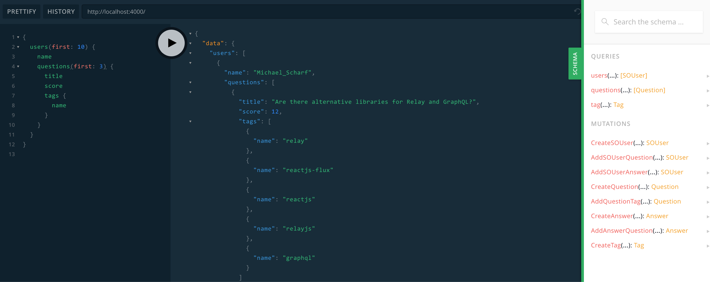
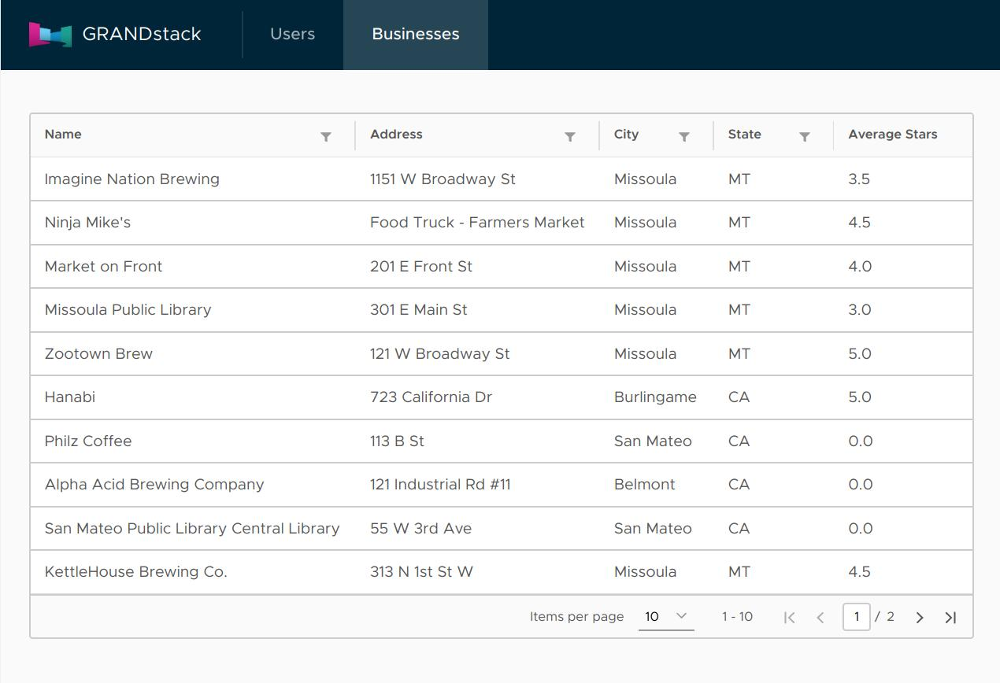

[](https://deploy.now.sh/?repo=https://github.com/grand-stack/grand-stack-starter&env=NEO4J_USER&env=NEO4J_URI&env=NEO4J_PASSWORD)

# GRANDstack Starter

This project is a starter for building a [GRANDstack](https://grandstack.io) (GraphQL, React, Apollo, Neo4j Database) application. There are two components to the starter, the UI application (in React and Angular flavors) and the API app (GraphQL server).

[](http://www.youtube.com/watch?v=rPC71lUhK_I "Hands On With The GRANDstack Starter")

## Quickstart

### Neo4j

You need a Neo4j instance, e.g. a [Neo4j Sandbox](http://neo4j.com/sandbox), a local instance via [Neo4j Desktop](https://neo4j.com/download), [Docker](http://hub.docker.com/_/neo4j) or a [Neo4j instance on AWS, Azure or GCP](http://neo4j.com/developer/guide-cloud-deployment) or [Neo4j Cloud](http://neo4j.com/cloud)

For schemas using the  `@cypher` directive (as in this repo) via [`neo4j-graphql-js`](https://github.com/neo4j-graphql/neo4j-graphql-js), you need to have the [APOC library](https://github.com/neo4j-contrib/neo4j-apoc-procedures) installed, which should be automatic in Sandbox, Cloud and is a single click install in Neo4j Desktop. If when using the Sandbox / cloud you encounter an issue where an error similar to `Can not be converted to long: org.neo4j.kernel.impl.core.NodeProxy, Location: [object Object], Path: users` appears in the console when running the React app, try installing and using Neo4j locally instead.

#### Sandbox setup
A good tutorial can be found here: https://www.youtube.com/watch?v=rPC71lUhK_I

#### Local setup
1. [Download Neo4j Desktop](https://neo4j.com/download/)
2. Install and open Neo4j Desktop.
3. Create a new DB by clicking "New Graph", and clicking "create local graph".
4. Set password to "letmein" (as suggested by `api/.env`), and click "Create".
5. Make sure that the default credentials in `api/.env` are used. Leave them as follows: `NEO4J_URI=bolt://localhost:7687 NEO4J_USER=neo4j NEO4J_PASSWORD=letmein`
6. Click "Manage".
7. Click "Plugins".
8. Find "APOC" and click "Install".
9. Click the "play" button at the top of left the screen, which should start the server. _(screenshot 2)_
10. Wait until it says "RUNNING".
11. Proceed forward with the rest of the tutorial.

### [`/api`](./api)

*Install dependencies*

```
(cd ./ui-react && npm install)
(cd ./ui-angular && npm install)
(cd ./api && npm install)
```

*Start API server*
```
cd ./api && npm start
```



### [`/ui-react`](./ui-react)

This will start the GraphQL API in the foreground, so in another terminal session start the React UI development server:

*Start the React UI server*
```
cd ./ui-react && npm start
```


### [`/ui-angular`](./ui-angular)

A UI built with [Angular](https://angular.io), [Apollo](https://www.apollographql.com/docs/angular/) and the [Clarity Design System](https://clarity.design) is also available.

*Start the Angular UI server*
```
cd ./ui-angular && npm start
```



See [the project releases](https://github.com/grand-stack/grand-stack-starter/releases) for the changelog.

## Deployment

### Zeit Now v2

Zeit Now v2 can be used with monorepos such as grand-stack-starter. [`now.json`](https://github.com/grand-stack/grand-stack-starter/blob/master/now.json) defines the configuration for deploying with Zeit Now v2.

1. Set the now secrets for your Neo4j instance:

```
now secret add NEO4J_URI bolt+routing://<YOUR_NEO4J_INSTANCE_HERE>
now secret add NEO4J_USER <YOUR_DATABASE_USERNAME_HERE>
now secret add NEO4J_PASSWORD <YOUR_DATABASE_USER_PASSWORD_HERE>
```

2. Run `now`

### Zeit Now v1

1. Run `now` in `/api` and choose `package.json` when prompted.
1. Set `REACT_APP_GRAPHQL_API` based on the API deployment URL from step 1 in `ui-react/.env`
1. Run `now` in `/env` and choose `package.json` when prompted.

## Docker Compose

You can quickly start via:
```
docker-compose up -d
```

If you want to load the example DB after the services have been started:
```
docker-compose run api npm run seedDb
```


This project is licensed under the Apache License v2.
Copyright (c) 2018 Neo4j, Inc.
