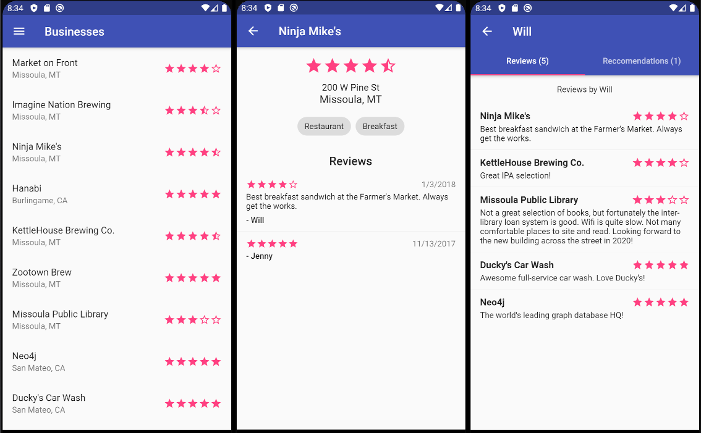

# GRANDstack Flutter Client

A rich native mobile UI for GRANDstack which runs on Android, iOS, and web.



## Getting Started

1. Install Flutter on your machine using these [instructions](https://flutter.dev/docs/get-started/install).

2. Optionally enable [web support](https://flutter.dev/docs/get-started/web) by switching to the beta channel.

3. Run `flutter pub get` to install dependencies.

4. `flutter run` to launch your app in debug mode. Or use the Flutter tools in your IDE.

## Build

If you change `lib/model/model.dart` you will need to regenerate the JSON serialization code by running this command:

```
flutter pub run build_runner build
```

If you wish to change the app icon in `assets/icons` you will need to update the source file in `pubspec.yaml`. This updates Android and iOS icons, web must be done manually. Run the following command:

```
flutter pub run flutter_launcher_icons:main
```
